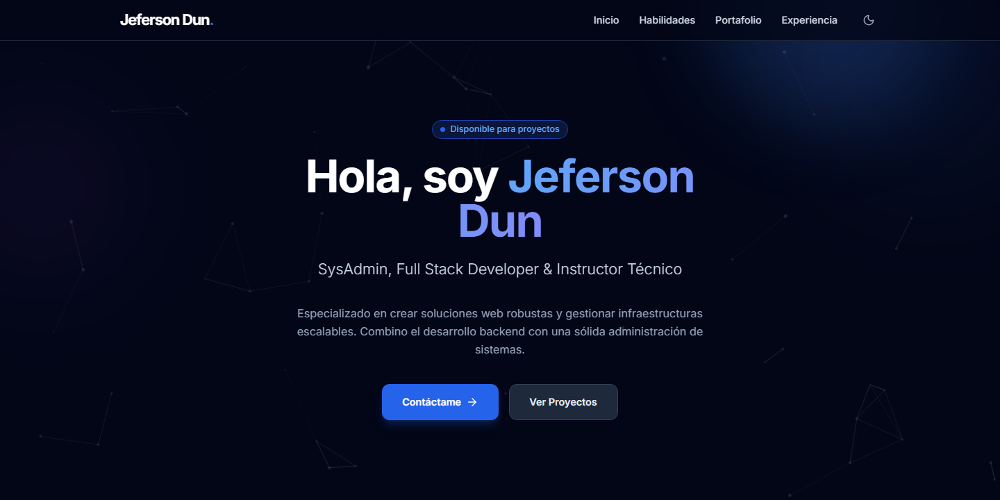

# 👨‍💻 Jeferson Dun - Portfolio Profesional



## 🌟 Sobre Mí

Hola! Soy **Jeferson Dun**, SysAdmin, Full Stack Developer e Instructor Técnico con experiencia en el diseño y desarrollo de soluciones web robustas y la gestión de infraestructuras escalables. Mi enfoque combina el desarrollo backend con una sólida administración de sistemas para crear aplicaciones que no solo funcionan, sino que escalan.

- 🔭 Actualmente trabajando en **DiplomadosOnline** como SysAdmin, Desarrollador y Tutor Especializado
- 🌱 Especializado en **PHP**, **MySQL**, **Linux**, **WordPress** y **vTiger CRM**
- 👨‍🏫 Mentor y Tutor titular impartiendo diplomados en: **SEO**, **Bases de Datos**, **BPM** y **WordPress**
- 💼 Disponible para nuevos proyectos y colaboraciones

---

## 🛠️ Stack Tecnológico

### Infraestructura
- Linux (Ubuntu/CentOS)
- Apache / Nginx
- Docker
- AWS / VPS

### Backend
- PHP Moderno (7.4+, 8.0+)
- MySQL / MariaDB
- RESTful APIs
- Node.js Basics

### Frontend
- JavaScript (ES6+)
- Tailwind CSS
- HTML5 / CSS3
- Responsive Design

### CMS & LMS
- WordPress Development
- Moodle Administration
- Plugin Development
- Theme Customization
- WPLMS Suite

### Docencia & Metodologías
- Mentoring Técnico
- Creación de Contenido Educativo
- Oratoria / Capacitación

---

## 🚀 Proyectos Destacados

### 🎓 [SISGA - Sistema de Gestión Académica](index.html#portafolio)
Sistema integral de gestión académica con arquitectura MVC y doble base de datos.

**Características principales:**
- Integración bidireccional con vTiger CRM
- Roles diferenciados (Admin, Profesor, Alumno)
- Generación dinámica de reportes
- Seguridad avanzada (CSRF, Bcrypt)
- Sistema de alertas de rendimiento

**Stack:** `PHP 7.4` `MVC Pattern` `MySQL` `vTiger CRM` `Tailwind CSS` `AJAX`

---

### 🛒 [Diplomados Online - E-commerce Educativo](index.html#portafolio)
Plataforma de venta de cursos con integración personalizada a CRM.

**Características principales:**
- E-commerce WordPress/WooCommerce
- Integración custom con vTiger API (Vanilla JS)
- Sistema de matriculación a medida
- Sincronización automática de datos
- Proceso de pago integrado

**Stack:** `WordPress` `WooCommerce` `Vanilla JS` `Elementor` `vTiger API`

---

### ⚙️ [vTiger CRM - Automatización de Procesos](index.html#portafolio)
Configuración avanzada de CRM con workflows y reportes personalizados.

**Características principales:**
- Workflows automatizados
- Suite VTExpert integrada
- PDF Maker para documentos dinámicos
- Email templates transaccionales
- Dashboards personalizados

**Stack:** `vTiger CRM` `VTExpert Suite` `Workflow Automation` `MySQL` `Apache`

---

### 🎯 [Campus Virtual - LMS Integral](index.html#portafolio)
Plataforma de E-learning completa con certificación automatizada.

**Características principales:**
- Gestión completa del ciclo educativo
- Dashboards interactivos por rol
- Certificación automática en PDF
- Evaluaciones y quizzes
- Red social educativa (BuddyPress)

**Stack:** `WordPress` `WPLMS Suite` `BuddyPress` `PDF Certificates` `Wordfence`

---

### 📱 [DolScan - Logística de Eventos QR](index.html#portafolio)
Sistema híbrido para control de asistencia en eventos masivos sin internet.

**Características principales:**
- Arquitectura dual (Web + Local)
- Funcionamiento 100% offline
- Sincronización en tiempo real
- Generación dinámica de códigos QR
- Múltiples interfaces (Staff, Orador, Admin)

**Stack:** `PHP` `MySQL Local` `Tailwind CSS` `JavaScript` `phpqrcode` `Offline-First`

---

### 📚 [Reto 500K - Sistema de Formación](index.html#portafolio)
Plataforma de gestión educativa con arquitectura MVC propia.

**Características principales:**
- Arquitectura MVC personalizada (sin frameworks)
- Patrones de diseño avanzados (Singleton, Factory, Active Record)
- Service Layer para lógica de negocio
- Progresión secuencial de contenido
- Roles: Admin, Gestor, Participante

**Stack:** `PHP 8` `MVC Pattern` `Service Layer` `MySQL` `Active Record` `JavaScript`

---

## 📊 Experiencia Profesional

### 💼 DiplomadosOnline | *Actual*
**SysAdmin, Desarrollador y Tutor Especializado**

- Administración de servidores y plataforma LMS
- Desarrollo de nuevas funcionalidades
- Optimización de rendimiento y seguridad
- Mentor y Tutor titular en diplomados especializados:
  - Estrategias SEO
  - Gestión de Bases de Datos
  - Business Process Management (BPM)
  - Desarrollo WordPress

### 🔧 Pegaso Consulting
**Soporte Técnico**

- Soporte técnico especializado
- Resolución de incidencias hardware/software
- Asistencia a usuarios finales

---

## 📫 Contacto

¿Interesado en trabajar juntos? ¡Hablemos!

- **Email:** [jefersonint25@gmail.com](mailto:jefersonint25@gmail.com)
- **LinkedIn:** [linkedin.com/in/jefersondun](https://linkedin.com/in/jefersondun)
- **GitHub:** [github.com/jeffd2599](https://github.com/jeffd2599)
- **Portfolio:** [Ver Portfolio Completo](index.html)

---

## 🎨 Características del Portfolio

Este portfolio web está construido con las siguientes tecnologías y características:

### Tecnologías Utilizadas
- **HTML5** semántico
- **Tailwind CSS** para estilos modernos
- **JavaScript (ES6+)** vanilla
- **Lucide Icons** para iconografía
- **Google Fonts (Inter)** para tipografía

### Características Destacadas
- ✨ Diseño moderno con glassmorphism y gradientes
- 🎨 Modo oscuro/claro
- 📱 Totalmente responsivo
- ⚡ Animaciones suaves y micro-interacciones
- 🖼️ Sistema de galería de proyectos con carrusel
- 🔍 Filtrado dinámico de proyectos
- 🎯 Navegación fluida entre secciones

### Estructura del Proyecto
```
jeff/
├── index.html          # Página principal
├── js/
│   ├── main.js        # Lógica principal (tema, navegación, animaciones)
│   └── projects.js    # Datos de proyectos y lógica del portfolio
├── img/
│   ├── projects/      # Imágenes de proyectos organizadas por carpeta
│   └── favicon.png    # Favicon del sitio
├── .gitignore         # Archivos ignorados por Git
└── README.md          # Este archivo
```

---

## 🚀 Instalación Local

Si deseas ejecutar este portfolio localmente:

```bash
# 1. Clona el repositorio
git clone https://github.com/jeffd2599/jeff.git

# 2. Navega al directorio
cd jeff

# 3. Abre index.html en tu navegador favorito
# O usa un servidor local como Live Server (VS Code)
```

**No requiere instalación de dependencias** - Es completamente estático y funcional desde el primer momento.

---

## 📝 Licencia

© 2024 Jeferson Dun. Todos los derechos reservados.

---

## ⭐ Agradecimientos

Diseñado con ❤️ y Tailwind CSS

Si te gusta este portfolio, ¡no olvides darle una ⭐ en GitHub!

---

<div align="center">
  <strong>¿Listo para trabajar juntos?</strong>
  <br>
  <a href="mailto:jefersonint25@gmail.com">📧 Contáctame</a>
</div>
